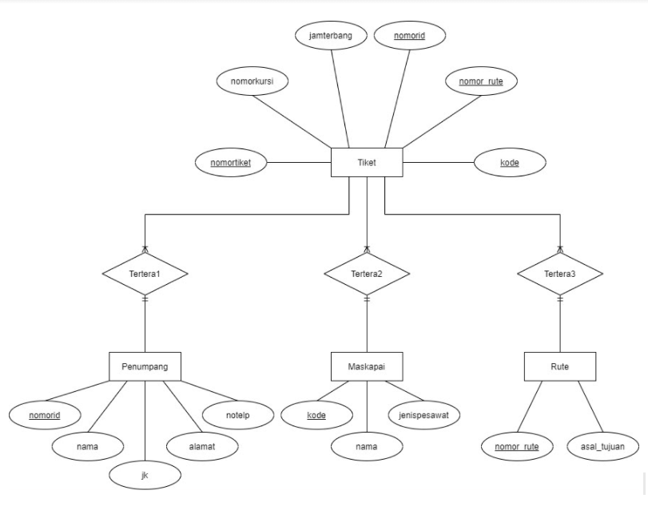

<!-- Logo Proyek -->
 

  

  <h3 align="center">Judul Proyek</h3>

  

    Deskripsi Proyek
  

<!-- Daftar Isi -->

  
<h2 style="display: inline-block">Daftar Isi</h2>

  <ol>
    <li><a href="#anggota-tim">Anggota Tim</a></li>
    <li><a href="#fungsi">Fungsi</a></li>
    <li><a href="#tujuan">Tujuan</a></li>
    <li><a href="#target-pengguna">Target Pengguna</a></li>
    <li><a href="#mockup-kasar">Mockup Kasar</a></li>
    <li><a href="#skema-database">Skema Database</a></li>
  </ol>

<!-- Anggota Tim -->
## Anggota Tim
| NPM           | Name                      |
| ------------- |---------------------------|
| 140810200019  | Muhammad Zidan Khairan    |
| 140810200027  | Harta Rama                |
| 140810200037  | Azka Ghafara Putra Agung  |

<!-- Fungsi -->
## Fungsi

TO;DO

<!-- Tujuan -->
## Tujuan

Tujuan dan manfaat dari pembuatan website ini yaitu untuk memahami mengenai implementasi dari penggunaan bahasa html, css, javascript, dan php dalam kehidupan sehari-hari. Tidak hanya itu hal ini juga memiliki tujuan dan manfaat sebagai latihan dalam membuat website melalui proses eksplorasi.

<!-- Target Pengguna -->
## Target Pengguna

Target pengguna dari website ini adalah pelanggan pesawat yang ingin memasukkan data penumpang mereka

<!-- Mockup Kasar -->
## Mockup Kasar

TO;DO

Gambar mockup di sini atau [link figma](https://figma.com/).

<!-- Skema Database -->
## Skema Database

Skema Database

ERD Database

